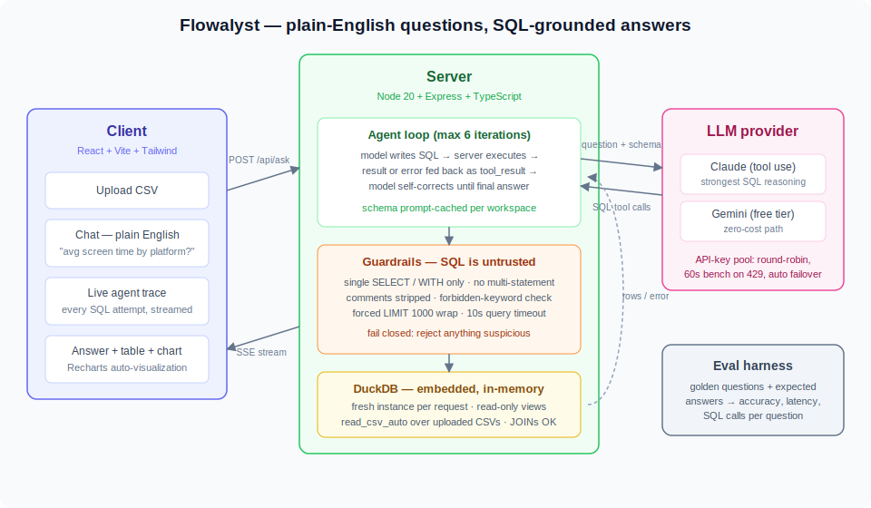

# Flowalyst

**Ask your CSV anything.** Upload a dataset, ask a question in plain English, and get an answer backed by real SQL — with the agent's every query attempt streamed live to the screen, so the reasoning is visible, not claimed.

Built from scratch — no LangChain, no Flowise. Express + TypeScript server, React + Vite client, LLM tool use with an embedded DuckDB engine.

## The problem

Most of the world's ad-hoc data lives in CSV files, and most of the people holding them can't write SQL. The existing ways out are all bad in a different direction:

- **Spreadsheets** break down the moment a question needs grouping, joining, or more than a few thousand rows.
- **Asking an analyst** turns a 30-second question into a day-long ticket.
- **Cloud "chat with your data" tools** require shipping your data to someone else's servers and trusting a black box — you see an answer, but not how it was produced.
- **Naive text-to-SQL** (one-shot LLM generation) fails silently: when the generated SQL is wrong, you either get a cryptic database error or, worse, a confidently wrong answer.

## The solution

Flowalyst is a **self-hosted AI data analyst** that treats the LLM as a junior analyst under supervision, not an oracle:

- The model gets exactly one tool — `run_sql` — and works in an **agentic loop**: write a query, watch it execute, read the result *or the error*, and self-correct until the answer is grounded in real query results.
- Every query passes through **guardrails** before touching the database, because LLM-generated SQL is untrusted input.
- Every answer arrives with **the SQL that produced it and the result table** — trust through auditability, not through faith.
- Your data **never leaves your machine**: DuckDB runs embedded in the server process and queries the CSV directly. No database server, no cloud, no import step.

## Architecture



## How it works

**1. Upload.** A CSV lands in `server/data/uploads`; the server infers its schema with DuckDB (`DESCRIBE`, sample rows, row count). No import — DuckDB queries the file in place via `read_csv_auto`.

**2. Ask.** The client POSTs the question to `/api/ask` and holds an SSE stream open. The server builds the agent's context: fixed analyst rules plus the schema of every uploaded table (columns, types, 3 sample rows). The schema block is stable per workspace and marked for **prompt caching**, so repeat questions pay a fraction of the input cost.

**3. The agent loop** (bounded at 6 iterations — cost and halting control):

```
model writes SQL ──▶ guardrails validate ──▶ DuckDB executes
      ▲                                          │
      └────── rows (success) or error ◀──────────┘
              fed back as a tool result
```

The key design decision: **errors go back to the model as failed tool results**, verbatim. A wrong column name, a bad cast, a typo — the model reads the actual DuckDB error and rewrites its own query. Self-correction beats any server-side retry logic, because the model can see *why* it failed.

**4. Guardrails — the security core.** Every generated query is validated before execution:

| Check | Blocks |
|---|---|
| Single statement only (no internal `;`) | multi-statement injection |
| Comments stripped before validation | keywords hidden in `--` or `/* */` |
| Must start with `SELECT` / `WITH` | everything that isn't a read |
| Keyword deny-list (`drop`, `attach`, `copy`, `install`, …) | writes, filesystem access, extension loading |
| Query wrapped in `SELECT * FROM (…) LIMIT 1000` | unbounded results, regardless of the inner query |
| 10-second timeout | runaway queries |
| Fresh in-memory DuckDB per request, read-only views | any cross-request state, any persistent damage |

Fail-closed by design: a rare legitimate query being rejected is acceptable; a destructive one being allowed is not. And even a hypothetical bypass lands in a throwaway in-memory database whose only contents are views over CSV files.

**5. Stream.** Text deltas, each SQL attempt, and each result/error are pushed to the client as SSE events — the UI renders the self-correction live. The final answer ships with the last successful query's result set, rendered as a table and an auto-picked chart.

**Also in the box:**

- **Follow-up questions** — prior Q/A pairs (capped at 8) ride along with each ask; "now break that down by gender" just works.
- **Multi-table JOINs** — every uploaded dataset is a named view in the per-request DuckDB instance; the agent sees all schemas.
- **Provider-agnostic core** — Claude and Gemini agents emit the same event stream from shared core logic (`agent-core.ts`); swapping providers is a config change, not a UI change. An API-key pool round-robins keys and benches any key that hits a rate limit, failing over mid-conversation.
- **Graceful degradation** — with no API key at all, the same chat box accepts raw SQL and still renders the table + chart.

## Impact

- **Removes the SQL barrier** — anyone who can phrase a question can interrogate a dataset, including grouping, filtering, and cross-file JOINs that are painful in spreadsheets.
- **Private by construction** — self-hosted, embedded database, no data leaves the machine. Usable on data you could never paste into a cloud tool.
- **Zero-cost to run** — works end-to-end on Gemini's free tier; zero infrastructure beyond Node.
- **Wrong SQL heals itself** — failed queries are corrected by the agent without user intervention, turning the most common text-to-SQL failure mode (silent wrong answers or cryptic errors) into a visible, self-resolving retry.
- **Measurable, not vibes** — a golden-set eval harness regression-tests answer accuracy, latency, and SQL-call count per question, so every prompt or guardrail change gets a before/after number.

## Quick start

```sh
npm install                      # root (concurrently)
npm install --prefix server
npm install --prefix client

# Provider (pick one) — put it in server/.env or export it:
#   GEMINI_API_KEY=...      free tier (aistudio.google.com)
#   ANTHROPIC_API_KEY=...   strongest SQL reasoning
# With neither key the app runs in manual SQL mode.
# If both are set, Anthropic wins; force one with PROVIDER=gemini|anthropic.

npm run dev                      # server on :5002, client on :5173
```

A seed dataset (`student_social_media`) is registered automatically. Try:

> *"What's the average screen time by platform?"*
> *"Do students who sleep more have better GPAs?"*

Without an API key, the same chat box accepts raw SQL against the table `data`:

```sql
SELECT most_used_platform, round(avg(daily_screen_time_hours),2)
FROM data GROUP BY 1 ORDER BY 2 DESC
```

## API

| Route | Purpose |
|---|---|
| `POST /api/datasets` | Upload a CSV (multipart, field `file`) |
| `GET /api/datasets` | List datasets |
| `GET /api/datasets/:id/schema` | Columns, types, sample rows, row count |
| `POST /api/datasets/:id/query` | Raw SQL (guarded) — also the no-key fallback path |
| `POST /api/ask` | `{datasetId, question}` → SSE agent stream |
| `GET /api/config` | `{hasApiKey}` — client picks agent vs manual mode |

## Evals

"How do you know the SQL is right?" — measure it:

```sh
npm run eval --prefix server                       # golden questions vs the active provider
PROVIDER=anthropic npm run eval --prefix server    # compare providers
```

`server/eval/golden.json` holds questions with regex expectations (including an honesty case asking about a column that doesn't exist — the correct answer is "the data can't tell you"). The runner prints pass/fail, latency, and SQL-call count per question, and self-paces on Gemini's free-tier rate limit.

## Project structure

```
server/src/
  index.ts        routes + SSE plumbing
  agent.ts        Claude tool-use loop (run_sql tool, prompt-cached schema)
  agent-gemini.ts Gemini function-calling loop (same event stream)
  agent-core.ts   shared rules, tool description, guarded SQL execution
  guardrails.ts   SELECT-only validation + LIMIT wrapping
  db.ts           DuckDB per-request instances, schema inference
  keypool.ts      round-robin API keys with 429 cooldown failover
  datasets.ts     upload manifest + seed registration
server/eval/
  golden.json     golden question set
  run.ts          eval runner (accuracy / latency / SQL calls)
client/src/
  components/Chat.tsx         chat, live trace cards, SQL block
  components/ResultTable.tsx  result table
  components/ResultChart.tsx  auto bar/line chart heuristic
  lib/api.ts                  fetch + SSE reader
```
